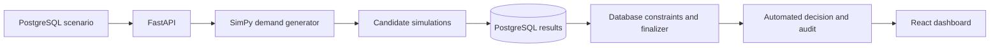

# LaneShift BD

**A database-centered traffic simulation and automated reversible-lane optimization system for Dhaka.**

LaneShift BD asks one measurable question:

> Can an automatically selected reversible-lane allocation reduce simulated queueing and delay compared with a fixed road layout?

Python SimPy generates stochastic vehicle arrivals and replays the same demand against every safe lane allocation. PostgreSQL validates the results, compares candidates, enforces the improvement threshold, selects the winning allocation, and preserves the complete audit history. React explains the experiment visually.

This is an educational digital twin. It does not control a real road or recommend unsupervised real-world lane reversal.

## What the demonstration does

1. Select a traffic scenario: balanced flow, morning surge, evening surge, accident, or heavy rain.
2. Select a Dhaka road segment and a reproducible random seed.
3. SimPy creates thousands of individual vehicle processes for one virtual hour.
4. Every allocation from `1/(N-1)` through `(N-1)/1` is tested with the identical demand stream.
5. Candidate waiting time, P95 delay, queue, throughput, speed, and objective score are written to PostgreSQL.
6. `finalize_simulation_run()` selects a different allocation only when it improves the congestion objective by at least 10%.
7. The dashboard displays fixed-versus-selected results, a queue chart, every candidate, and the database audit trail.

With the included `morning_peak` scenario, AIR-01, and seed `4410`, the fixed `3/3` road develops a large inbound queue. PostgreSQL selects `4/2` after SimPy evaluates all five legal configurations.

## Architecture



### Responsibility boundary

| Layer | Responsibility |
| --- | --- |
| SimPy | Generate random vehicle arrivals, model lane queues, replay equal demand, and measure candidates |
| PostgreSQL | Store scenarios/runs/samples, validate lane totals, enforce lifecycle rules, select a qualified winner, prevent schedule overlap, and audit decisions |
| FastAPI | Coordinate the simulation worker and expose database-backed endpoints |
| React | Start experiments and visualize comparisons, history, database evidence, and safety overrides |

Python is deliberately stateless between runs. PostgreSQL is the system of record and the decision authority.

## DBMS scope

- 21 normalized domain tables after the simulation extension
- Primary keys, foreign keys, checks, unique constraints, range types, JSONB, and indexes
- Partial unique indexes allowing one baseline and one selected candidate per run
- GiST exclusion constraint preventing overlapping lane schedules
- Validated run-state transitions: `queued → running → completed/failed`
- Candidate and decision lane-total triggers
- Database-owned 10% minimum improvement rule
- Transactional candidate persistence and finalization
- Analytical comparison views using `RANK()`
- Existing `LAG()` sustained-pressure analysis and corridor reporting
- Event-level decision and override audit history
- Five data-driven traffic scenarios and seven Dhaka road segments

## Technology

- PostgreSQL and PL/pgSQL
- Python, SimPy, FastAPI, and Psycopg
- React and Vite
- Pytest and SQL verification scripts

## Quick start on macOS

This copy is already installed and connected on the development Mac. Open this folder in VS Code and run:

```bash
./scripts/start_all_mac.sh
```

For a first installation on another Mac, install PostgreSQL, Python 3, and Node.js, then run:

```bash
chmod +x scripts/*.sh
./scripts/setup_mac.sh
./scripts/start_all_mac.sh
```

Open:

- Dashboard: <http://127.0.0.1:5173>
- API documentation: <http://127.0.0.1:8000/docs>
- API health: <http://127.0.0.1:8000/health>

See [`docs/INSTALLATION_AND_TESTING.md`](docs/INSTALLATION_AND_TESTING.md) for first-time setup and troubleshooting. See [`docs/TEACHER_DEMO.md`](docs/TEACHER_DEMO.md) for a short classroom demonstration script.

## Testing

Run the complete verification suite:

```bash
./scripts/test_all_mac.sh
```

It checks:

- PostgreSQL assertions and intentional constraint failures
- deterministic traffic generation from a fixed seed
- all safe candidate allocations
- balanced, directional-pressure, and incident behavior
- unsafe lane-split rejection
- FastAPI request validation
- React production compilation

## Main project folders

```text
LaneShift-BD/
├── backend/
│   ├── app/
│   │   ├── main.py                 FastAPI routes
│   │   ├── simulation.py           pure SimPy engine
│   │   └── simulation_service.py   database orchestration
│   └── tests/                       Pytest suite
├── database/
│   ├── 01_schema.sql                tables and constraints
│   ├── 02_logic.sql                 functions, triggers, procedures
│   ├── 03_views.sql                 analytical views
│   ├── 04_seed.sql                  Dhaka data and scenarios
│   ├── 05_verification.sql          automatic DBMS checks
│   └── 06_upgrade_v1_to_v2.sql      non-destructive upgrade for the old project
├── frontend/                        React experiment dashboard
├── scripts/                         setup, run, reset, and test commands
└── docs/                            ERD, demo guide, API collection, validation
```

## Authors

- Hasan Mobarak Mahi — ID 230042129
- Rufayed Rehan — ID 230042121
