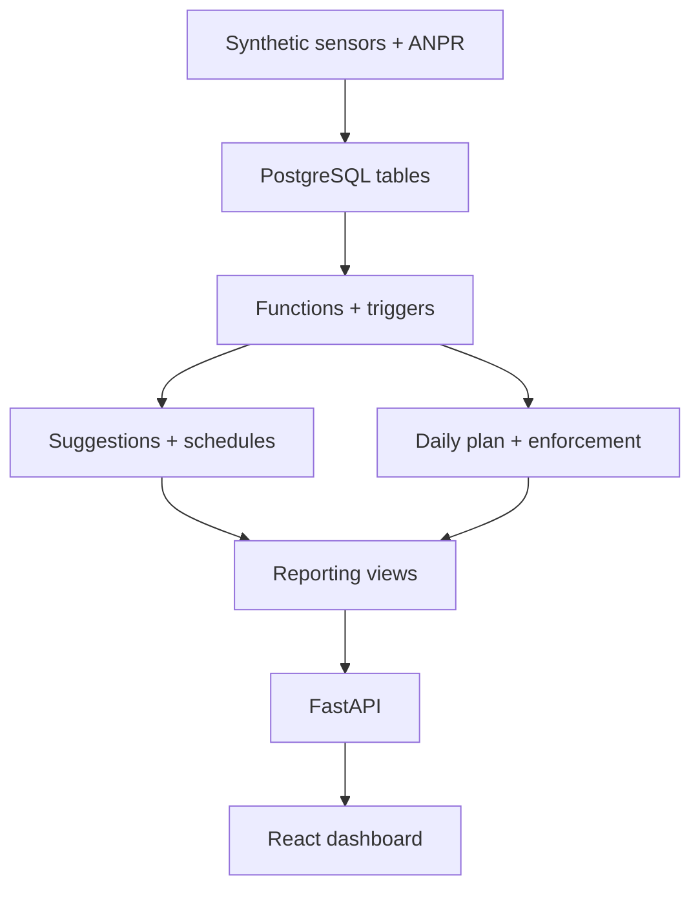

# LaneShift BD

LaneShift BD is a PostgreSQL-first decision-support system for Dhaka’s directional peak-hour traffic. It analyzes hourly sensor readings and ANPR/vehicle-fitness data, recommends reversible-lane allocations, requires approval, prevents schedule overlap, and dispatches enforcement teams when unfit vehicles are a major cause of congestion.

## Implemented scope

- 15 normalized PostgreSQL tables with primary keys, foreign keys, checks, uniqueness, indexes, and audit data
- `tstzrange` lane schedules protected by a GiST exclusion constraint
- Functions for direction imbalance, unfit-vehicle ratio, and lane recommendations
- Sustained-imbalance trigger and approval/application triggers
- Cursor-driven daily planning procedure that covers every active segment
- `LAG()` and `RANK()` window-function analysis plus a CTE slow-vehicle signature
- Live segment and corridor reporting views
- 3 Dhaka corridors, 7 road segments, 24 vehicles, 252 hourly readings, and 672 ANPR detections
- FastAPI backend with dashboard, suggestions, schedules, approval, and plan endpoints
- Responsive React operations dashboard
- macOS setup, launch, reset, SQL verification, Swagger, and Postman workflows

## Architecture



The database owns the business decisions. FastAPI is a thin query/command layer, and React is an operator interface.

## Quick start on macOS

Read [`docs/INSTALLATION_AND_TESTING.md`](docs/INSTALLATION_AND_TESTING.md) first. After installing PostgreSQL, Python, and Node.js:

```bash
chmod +x scripts/*.sh
./scripts/setup_mac.sh
./scripts/start_all_mac.sh
```

Open <http://127.0.0.1:5173> for the dashboard and <http://127.0.0.1:8000/docs> for API testing.

## Project folders

```text
LaneShift-BD/
├── database/   schema, PL/pgSQL logic, views, seed data, verification
├── backend/    FastAPI application and Python dependencies
├── frontend/   React/Vite dashboard
├── scripts/    macOS setup, launch, and reset commands
└── docs/       detailed guide, ERD source, Postman collection
```

## Authors

- Hasan Mobarak Mahi — ID 230042129
- Rufayed Rehan — ID 230042121
